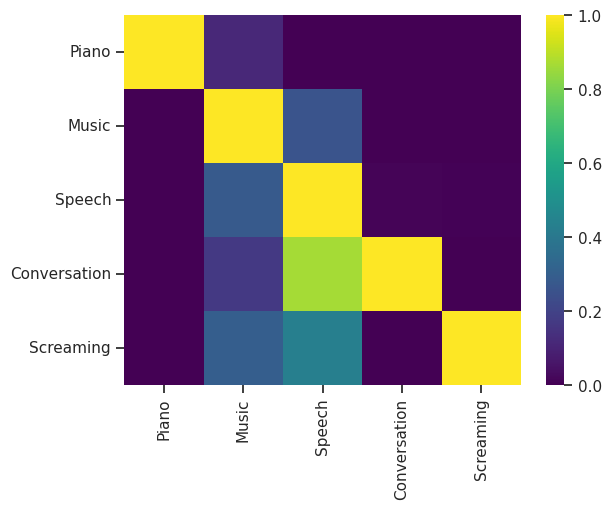
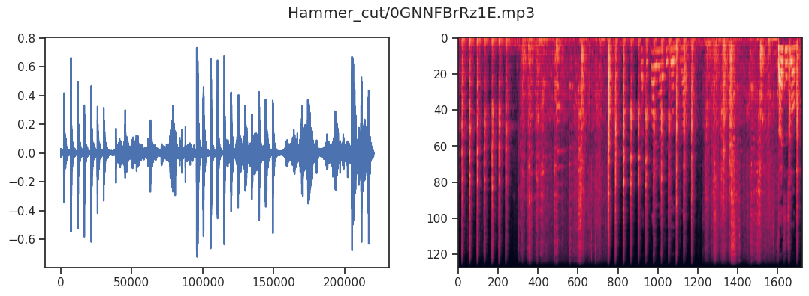

# AudioSet data pipeline

This project turns AudioSet metadata into small, labelled audio segments for analysis. It covers metadata cleaning, label mapping, selective YouTube audio acquisition, FFmpeg segmentation, and exploratory visualisation.

Downloaded media and authentication cookies are deliberately **not** stored in this repository. Audio is generated locally from the retained [AudioSet](https://research.google.com/audioset/) identifiers and timestamps.

## Repository layout

```text
main/
├── q1.py                   # AudioSet label utilities
├── q2.py                   # Audio download and FFmpeg segmentation
├── q3.py                   # Filtering, orchestration, and file naming
├── visualize.ipynb         # Metadata analysis and pipeline walkthrough
├── data/
│   ├── audio_segments.csv
│   ├── audio_segments_clean.csv
│   └── ontology.json
├── images/                 # Retained analysis figures
├── environment.yml
└── requirements.txt
```

## Setup

The Conda environment installs both the Python wrapper and the native FFmpeg executable:

```bash
conda env create -f main/environment.yml
conda activate ift6758-conda-env-2
cd main
jupyter lab visualize.ipynb
```

For a pip installation, install the packages in `main/requirements.txt` and install FFmpeg separately through your operating system.

## Generate audio locally

Run the pipeline from `main/`:

```python
from q3 import data_pipeline, rename_files

data_pipeline("data/audio_segments_clean.csv", "Cough")
rename_files("audio/Cough_cut", "data/audio_segments_clean.csv")
```

The generated files are written to `audio/<Label>_raw/` and `audio/<Label>_cut/`. These directories are ignored by Git and can be regenerated.

Most public videos do not require authentication. If a video legitimately requires access from your own account, pass an external cookie export explicitly:

```python
data_pipeline(
    "data/audio_segments_clean.csv",
    "Cough",
    cookiefile="/absolute/path/outside-this-repository/cookies.txt",
)
```

Never place or commit a cookie export inside the repository. Some AudioSet videos may have been removed, made private, or restricted since the metadata was published; the pipeline skips unavailable items.

## Retained results




